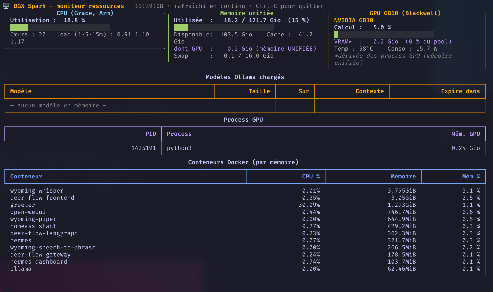
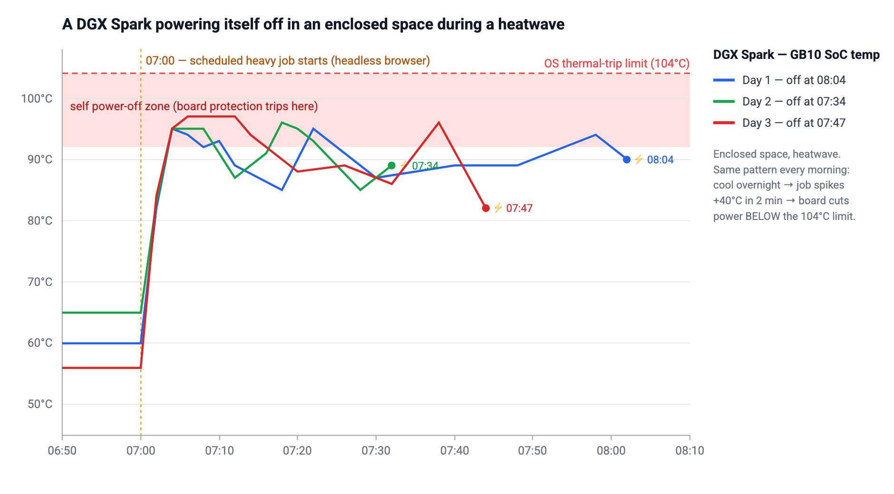

# DGX Spark — a home "Edge AI"

A personal, bilingual (🇫🇷/🇬🇧) field report on running a **NVIDIA DGX Spark (GB10)**
as a home AI "edge computing" foundation: local LLMs, secure private access, AI document
sorting, local coding agents, and an augmented smart mirror that sees, hears and understands —
all without any personal data leaving the home.

**▶ Live page: https://ohoachuck.github.io/dgx-spark-edge-ai/**

Use the **FR / EN** button (top-right) to switch language; the choice is remembered.

---

## Tools in this repo

Small, focused, dependency-light utilities born out of actually living with a Spark. Each is its
own self-contained sub-project, with its own README and MIT license.

### 📊 [`dgx-mon`](dgx-mon/) — real-time resource monitor

A terminal TUI to watch what your Spark is doing **live**: CPU (Grace), the GB10's **unified
memory**, GPU, the loaded Ollama model and the containers — the metrics that actually matter on a
unified-memory machine. → **[dgx-mon/README.md](dgx-mon/README.md)**

### 🌡️ [`thermal-tools`](thermal-tools/) — keep it alive under heavy load in the heat

`thermal-gate` + `thermal-run`: two tiny Bash helpers so any job can avoid pushing the Spark into
its **own hardware power-off** when it heats up faster than it can cool. Includes the **lesson
learned** — a Spark in a closed cabinet during a heatwave shutting *itself* off every morning,
**below** the 104 °C OS limit, with the temperature chart to prove it.
→ **[thermal-tools/README.md](thermal-tools/README.md)**

