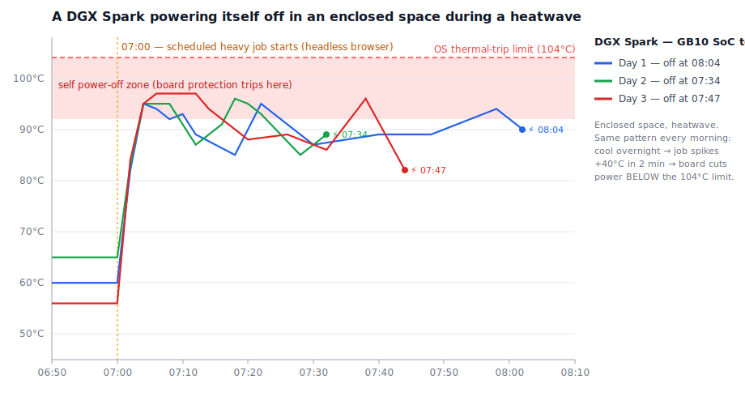

# `thermal-tools` — keep a DGX Spark alive under heavy load in a hot, enclosed space

Two tiny, dependency-free Bash helpers — **`thermal-gate`** and **`thermal-run`** — that let
any script protect a **NVIDIA DGX Spark (GB10)** from tripping its own hardware power-off when a
heavy job heats it up faster than it can dissipate.

They exist because of a real lesson learned (below). The short version: **a Spark in an enclosed
space during a heatwave will quietly power *itself* off — and it does so well before the OS-level
104 °C limit.**

---

## The lesson learned

The Spark was tucked inside a **closed cabinet** (poor airflow), and a summer **heatwave** hit.
Every morning it was simply **off** — the wall socket was still powered, so the *machine itself*
had shut down, and it would not come back until power-cycled by hand.

So I logged the on-die temperature every 2 minutes and watched. The pattern was identical three
days in a row:



- **Overnight it sat cool**, ~55–65 °C.
- At a fixed time a **scheduled heavy job** kicked in (a headless-browser scrape). Within
  **~2 minutes the SoC jumped +40 °C, to 95–97 °C**.
- In the **closed cabinet the heat had nowhere to go**, so it stayed pegged in the 90s.
- A few tens of minutes later the board **cut its own power** — abruptly, with **no clean
  shutdown in the logs** (the journal just stops mid-line).
- Crucially, this happened **below the 104 °C OS thermal-trip**: an **internal protection (SoC
  junction / power-delivery) trips first**, at a sensor the OS never exposes.
- The daily peak **crept up with the heatwave** (94 → 95 → 96 → 97 °C), each day a little closer
  to a hard cut.

### What it tells you about the device

The DGX Spark (GB10) is a **compact, powerful** machine with **limited active-cooling headroom**.
Under sustained heavy load **in a hot ambient and/or an enclosure**, it can reach its protection
limit and shut down to save itself. There is **no magic software fix for poor placement** — the
real cure is airflow:

> **Don't run a Spark hard inside a closed cabinet during a heatwave.** Give it open space and,
> if ambient is high, a fan pointed at the unit *and its power brick* (the brick has its own
> thermal cutoff too). Everything below is **damage control**, not a cure.

That said, you often can't relocate hardware instantly — so these two tools keep the machine
*up and your data safe* by degrading the **job** instead of crashing the **box**.

---

## The tools

### `thermal-gate` — *should I start a heavy job right now?*

A pre-flight check any script can call. Exits `0` when it's cool enough, `1` when it's too hot.

```bash
# only scrape/transcode/train/… if we're under the threshold
thermal-gate && ./heavy_job.sh

thermal-gate temp        # -> e.g. "59"  (hottest of GPU + ACPI zones, °C)
thermal-gate check       # gate + a one-line status on stderr
thermal-gate wait 600    # block until it cools (or give up after 600 s)
```

Threshold via `THERMAL_LIMIT` (default **80 °C**):

```bash
THERMAL_LIMIT=75 thermal-gate && ./heavy_job.sh
```

> A pre-check can't stop a job that *starts cool and heats itself up* — that's what `thermal-run`
> is for. But it does stop you from **piling new load on an already-hot machine** (e.g. the next
> hourly run while it's still in the 90s), which is half the battle in an enclosure.

### `thermal-run` — *cap the temperature while the job runs*

Wraps any command and **kills it (whole process group) if the temperature crosses a limit during
execution** — so a single cold-start job can't drag the board into its power-off zone.

```bash
thermal-run ./heavy_job.sh                      # killed if it crosses 90 °C
THERMAL_KILL=88 thermal-run ffmpeg -i in.mov …  # custom kill point
```

Env: `THERMAL_KILL` (default **90 °C**), `THERMAL_POLL` (default **5 s**), `THERMAL_LOG`.

### Using them together

```bash
# don't even start if already warm; and if the job heats things up, cap it
thermal-gate && thermal-run ./heavy_job.sh
```

A cron example (skip when hot, and cap the run otherwise):

```cron
0 * * * * /path/to/thermal-gate && /path/to/thermal-run /path/to/heavy_job.sh
```

---

## How it reads temperature

Both use the **hottest** of:
- the GPU, via `nvidia-smi --query-gpu=temperature.gpu` (if present), and
- every `/sys/class/thermal/thermal_zone*/temp` (ACPI zones).

No Python, no packages — just Bash + the kernel's thermal sysfs (and `nvidia-smi`, already on a
DGX). Works on any Linux box; the thresholds are tuned for the GB10's behaviour.

## Honest limitations

- These **protect the machine, not the workload**: in a bad cooling situation the heavy job will
  be **skipped or killed** (you lose that run's output), not magically completed.
- They react to **OS-visible** temperatures. The board's *internal* cut can fire a touch lower —
  so leave margin (the 90 °C kill is deliberately below the observed 95–97 °C cut).
- **Placement and airflow remain the actual fix.** Treat this as a seatbelt, not an engine.

**License**: MIT — see [`LICENSE`](LICENSE).
